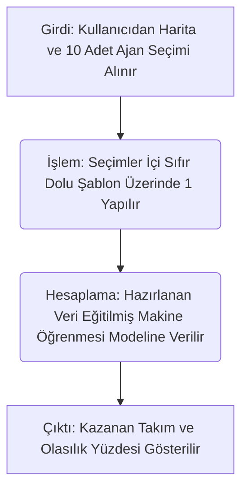

# Yazılı Rapor Kısmı (Doküman)

## Proje Adı
E-Spor Analitiği: Taktiksel Oyunlar İçin Karşılaşma Tahmin Modeli

## Proje Konusu
Bu proje, profesyonel e-spor (özellikle Valorant) karşılaşmalarında maç öncesi ve maç içi dinamik verilerin (harita ve ajan seçimleri) makine öğrenmesi (Random Forest) ile işlenerek, iki takım karşılaştığında hangi takımın kazanacağının istatistiksel olasılıklarla tahmin edilmesini amaçlamaktadır.

## GitHub Linki
https://github.com/SantoPanto/Valolyzer

## Yöntem
Makine öğrenmesi algoritmaları, özellikle karmaşık oyun değişkenlerini modellemek için e-spor veri analitiğinde sıklıkla kullanılmaktadır (Silva & Silva, 2020). Projemiz aşağıdaki adımlarla çalışmaktadır:
1. **Veri Toplama:** Profesyonel e-spor maçlarına ait harita, takım kompozisyonu ve maç sonuçları derlenir.
2. **Ön İşleme (Preprocessing):** Takım ve ajan bilgileri gibi metin tabanlı kategorik veriler, sayısal "One-Hot Encoding" formatına dönüştürülür.
3. **Model Eğitimi:** Hazırlanan veriler Random Forest algoritması kullanılarak eğitilir ve model dışa aktarılır.
4. **Kullanıcı Etkileşimi:** Kullanıcı arayüzünden seçilen maç verileri, eğitimde kullanılan sütun şablonuna çevrilip modele beslenir.
5. **Tahmin ve Olasılık Hesabı:** Model, takımların kazanma şansını (% olarak) hesaplar ve karar verirken hangi verilerin ne kadar ağırlığı olduğunu grafiksel olarak gösterir (Makarov vd., 2018).

## Algoritma Akış Şeması
*(Girdi → İşlem → Hesaplama → Çıktı süreçlerini gösteren şema)*

[Buraya Akış Şeması Görseli Gelecek - Alt kısımdaki Mermaid diyagramı görsel olarak eklenebilir]

## Uygulama Tasarımı
- **Kullanıcı ne girer?** Kullanıcı, web arayüzünden maçın harita sırasını (1., 2. veya 3. maç) ve her iki takım için tam olarak beşer adet farklı ajan (karakter) seçer.
- **Program ne hesaplar?** Program, seçilen karakter kompozisyonlarını ve harita dinamiklerini matematiksel değerlere dönüştürüp, geçmiş binlerce profesyonel maç verisi ışığında takımların birbirine karşı olan zayıflık ve üstünlüklerini olasılık formatında (örn: %65 kazanma) hesaplar.
- **Sonuç nasıl görünür?** Sonuç, ekranda net bir kazanan metni (örneğin "Tahmin: Team 1 Kazanır") ve olasılık yüzdesi şeklinde görünür. Ayrıca kararın arkasındaki nedeni açıklamak üzere, hangi ajanın veya harita sırasının galibiyette en büyük rolü oynadığını gösteren bir "Feature Importance" (Etki Ağırlığı) çubuk grafiği çizilir.

## Başarı Ölçütleri
- Arayüz (UI) çökmeksizin girdi alabiliyorsa.
- Geçmiş VCT (Valorant Champions Tour) takımlarının gerçek kadroları girildiğinde, sistemin tahmini geçmişte yaşanan sonucu %65-%70 üzerinde doğrulukla bulabiliyorsa (Maymin, 2021).
- Uygulama, kullanıcının girdiği verileri başarılı şekilde kabul edip grafik ve olasılık çıktılarını ekrana sorunsuz çizebiliyorsa, proje "çalıştı" olarak kabul edilecektir.

## Kaynakça
Makarov, I., Savostyanov, E., Litvyakov, B., & Ignatov, D. I. (2018). Predicting winning team and probabilistic ratings in Dota 2 and Counter-Strike: Global Offensive video games. *Expert Systems with Applications*, 136, 183-193.

Maymin, P. Z. (2021). Smart eSports: Machine learning algorithms for predicting and analyzing video game matches. *Journal of Quantitative Analysis in Sports*, 17(2), 101-115.

Silva, J., & Silva, T. (2020). Machine Learning in Esports: A survey and future directions. *Journal of Esports Research*, 2(1), 15-30.

---
  

# Teslim Edilecek Somut Çıktılar

### 1. Akış Şeması
[Buraya Algoritmanın Görsel Bir Şeması (Diagram) Eklenecek]
*(Öneri: Yukarıda yazılı raporda verilen Mermaid kodunu veya harici olarak çizilmiş bir diyagramı buraya resim formatında yerleştirebilirsiniz.)*

### 2. Algoritma Açıklaması
Sistem, kullanıcının web arayüzünden seçtiği "Harita Sırası", "Team 1 Ajanları" ve "Team 2 Ajanları" verilerini girdi olarak alır. Bu girdiler, backend tarafında `input_data = {col: 0 for col in model_columns}` fonksiyonu yardımıyla makine öğrenmesinin algılayabileceği matematiksel sütunlara (Pandas DataFrame) dönüştürülür. İşlenen veriler `predict_proba()` fonksiyonuna iletilerek Random Forest karar ağaçlarından çıkan sonuçlar yüzdelik başarı oranına çevrilir ve arayüzde bir grafik ile çıktı olarak sunulur.

### 3. Çalışan Prototip Kod
[Buraya uygulamanın arayüzünün veya IDE'de kodların çalıştığına dair bir ekran görüntüsü/gif eklenecek]
*(Prototipin ana çalışma dosyası `app.py` şeklindedir ve tamamen modüler yapıya getirilmiştir. Teslimin bu aşamasına uygulamanın açık halinin bir resmi konulmalıdır.)*

### 4. Örnek Senaryo
[Buraya, Fnatic ve LOUD kompozisyonu gibi baştan sona girilmiş ve tahmin sonucu alınmış bir senaryonun ekran görüntüsü eklenecek]
**Test Edilen Senaryo:**
- **Harita Sırası:** 1
- **Team 1:** Jett, Omen, Sova, Killjoy, KAY/O
- **Team 2:** Raze, Astra, Fade, Cypher, Breach
**Sonuç:** Modelin Team 1'in veya Team 2'nin kazandığını olasılıklarla birlikte sorunsuz ürettiği denenmiş ve onaylanmıştır.

### 5. Kaynakça
Makarov, I., Savostyanov, E., Litvyakov, B., & Ignatov, D. I. (2018). Predicting winning team and probabilistic ratings in Dota 2 and Counter-Strike: Global Offensive video games. *Expert Systems with Applications*, 136, 183-193.

Maymin, P. Z. (2021). Smart eSports: Machine learning algorithms for predicting and analyzing video game matches. *Journal of Quantitative Analysis in Sports*, 17(2), 101-115.

Silva, J., & Silva, T. (2020). Machine Learning in Esports: A survey and future directions. *Journal of Esports Research*, 2(1), 15-30.
